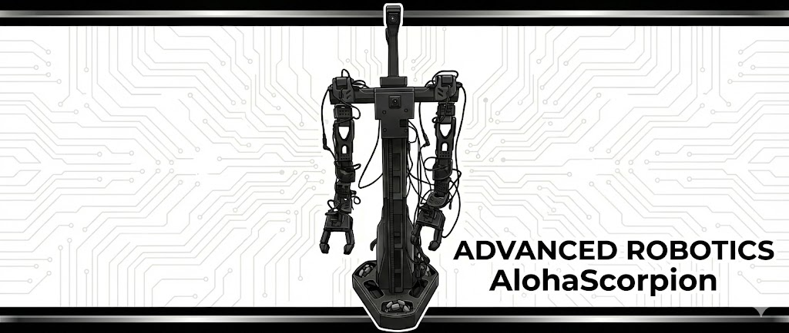
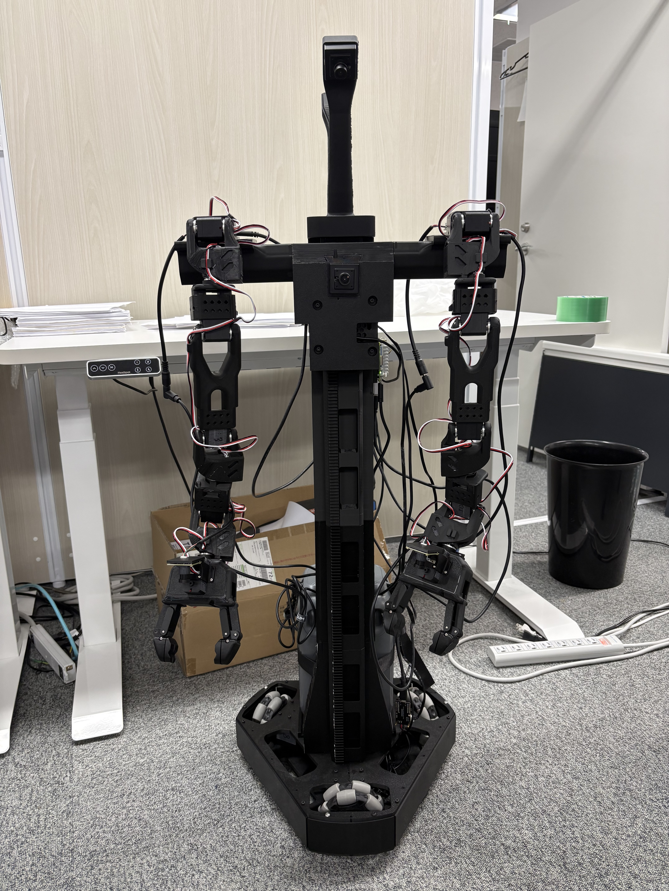
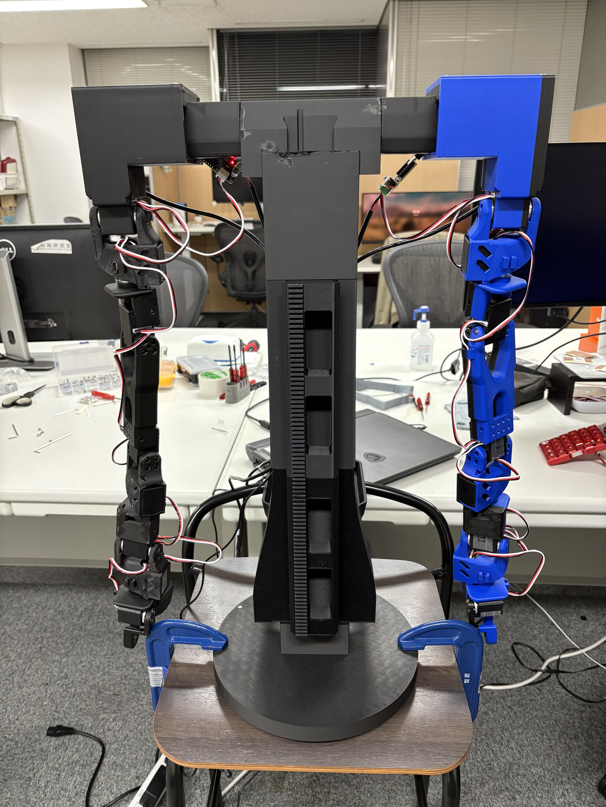
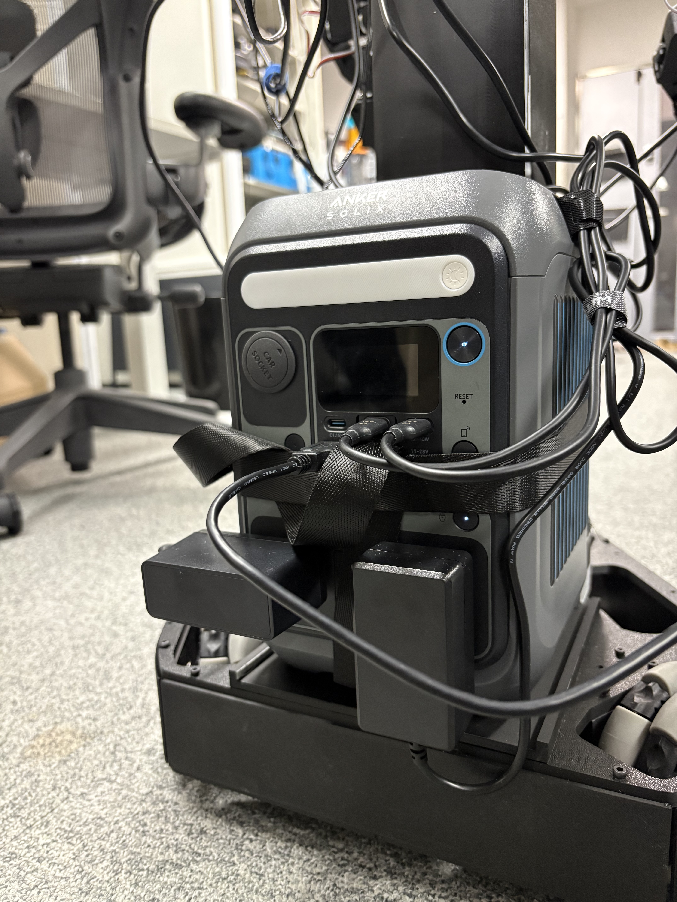
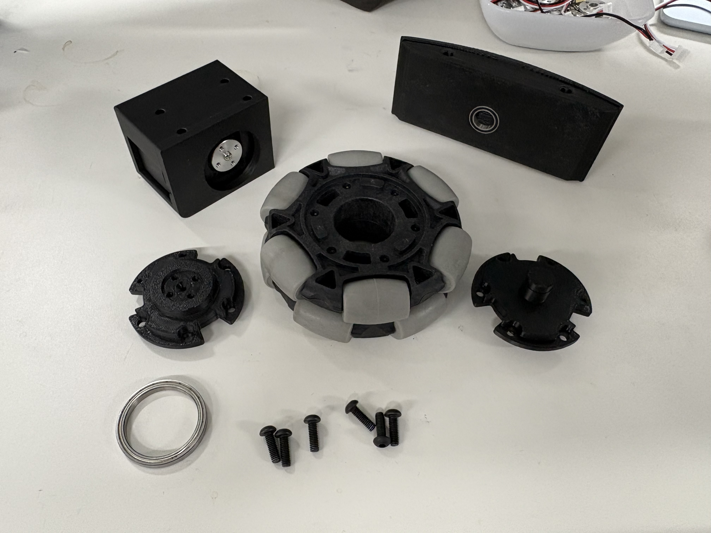
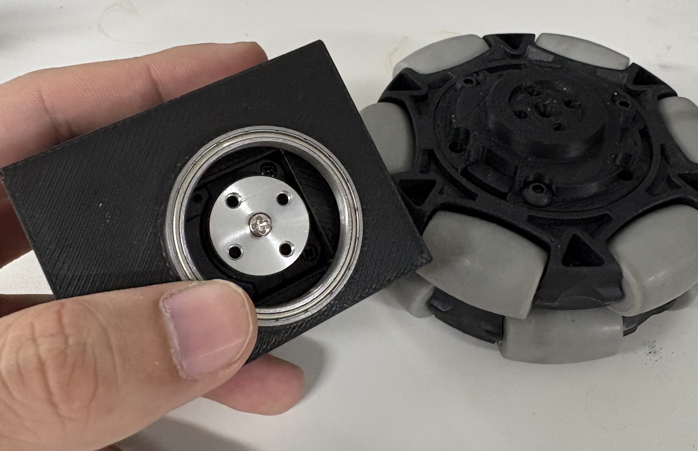
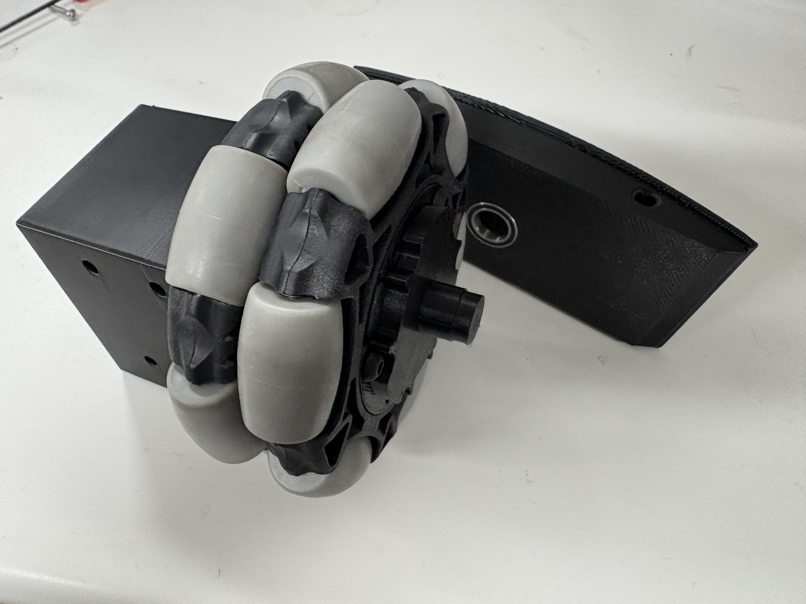
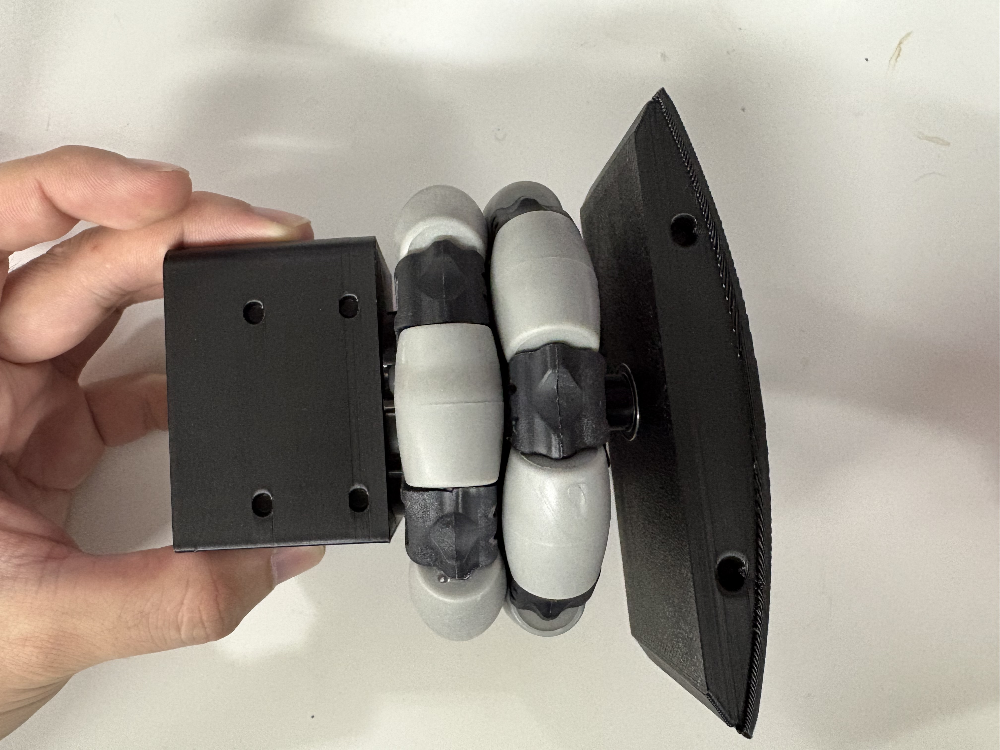
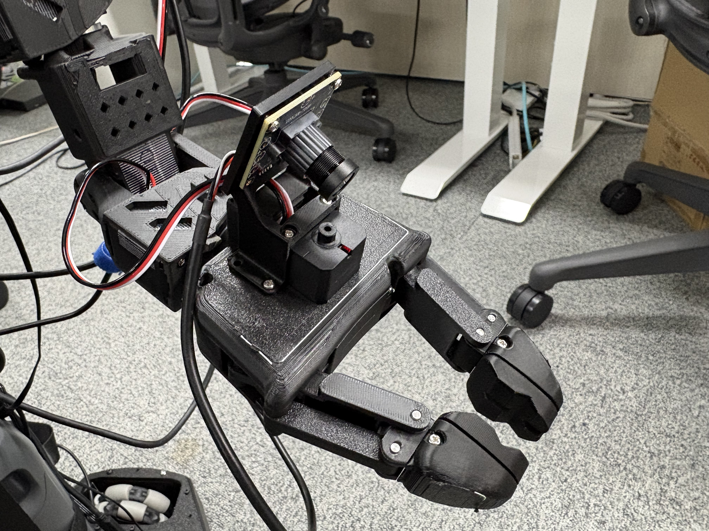

# AlohaScorpion

<p align="center">
  
</p>

AlohaScorpion is a 7 dof + gripper, dual-arm mobile manipulator with lift. It is designed for research and development in robotics, particularly in manipulation and mobile robotics.
This project is heavily inspired by the 

- Lerobot(https://github.com/k1000dai/lerobot)
- Alohamini(https://github.com/liyiteng/AlohaMini)
- Xlerobot(https://github.com/Vector-Wangel/XLeRobot)
- DualScorpion(https://github.com/momoiorg-repository/dual_scorpion)
- PincOpen(https://github.com/pollen-robotics/PincOpen)


## Update Log 
2/14 : Updated to the version 2.0. Better BOM, better chassis design, better arm position, pincopen gripper.

## To Do

- [ ] Add more details to the assembly instructions.
- [ ] Support VLA training.
- [ ] Support URDF and simulators.

## Images
<p align="center">
  
  
</p>


## Features
- 7 degrees of freedom per arm for enhanced manipulation capabilities. inspired by dual_scorpion

- Large battery capacity for extended operation time. based on the Xlerobot. Use Anker Solix C300 Portable Power Station 288Wh.


<p align="center">
  
</p>

- Mobile base for navigation and mobility. based on alohamini. Using the Xlerobot chassis design, stronger and more stable than alohamini's chassis.

<p align="center">
  
  
</p>
<p align="center">
  
  
</p>

- Gripper for object handling. We use the PincOpen gripper, which is open-source parallel-finger gripper, derived from Pollen Robotics Reachy 2's gripper. It is compatible with the arms of AlohaScorpion.

<p align="center">
  
</p>

- Lift mechanism for vertical movement. based on Alohamini.

- Data collection and logging capabilities for research purposes. based on the lerobot framework. compatible with lerobot v0.4.3.

## Bill of Materials (BOM)
The complete Bill of Materials (BOM) can be found in the this Google Sheet : https://docs.google.com/spreadsheets/d/1W7IXB0Fid7SDyZUYEEcC63fRW-HXA5QO-rrAWQz4-Ek/edit?usp=sharing.

If you want to use  parallel-finger gripper, you can refer PincOpen github repository[https://github.com/pollen-robotics/PincOpen] for the BOM and assembly instructions. The gripper is compatible with the arms of AlohaScorpion. You need to use the updated mount plate in hardware/misc/stl/sointerface.stl.


## Assembly Instructions
Please see AlohaMini's assembly instructions as the mobile base and lift mechanism are almost the same.

Also, for the arms, please follow the dual_scorpion's assembly instructions. In order to keep the motor id, we use the 0 ~ 
7 motor for the arms. 8,9,10,11 motors are used for the mobile base and lift mechanism.


## Software

### Environment Setup
We setup the host with raspberry pi 5. You can also use any PC or raspberry pi 5 as the host.

install uv
```
curl -LsSf https://astral.sh/uv/install.sh | sh
```

```
git clone https://github.com/k1000dai/AlohaScorpion.git
cd AlohaScorpion
uv sync  --extra feetech
uv pip install zmq
```

### Running the Software
#### teleoperation
host side
```
python -m lerobot.robots.alohamini_scorpion.lekiwi_host
```

client side
```
python examples/alohamini_scorpion/teleoperate_bi.py \
--remote_ip ip_address_of_host \
```

#### data collection

- sample dataset : https://huggingface.co/datasets/k1000dai/alohascorpion_pick_plate_put_box
host side
```
python -m lerobot.robots.alohamini_scorpion.lekiwi_host
```
client side
```
python examples/alohamini_scorpion/record_bi.py \
--remote_ip ip_address_of_host \
--dataset user/my_dataset_name 
```

#### Replay
host side
```
python -m lerobot.robots.alohamini_scorpion.lekiwi_host
```

client side
```
python examples/alohamini_scorpion/replay_bi.py \
--remote_ip ip_address_of_host \
--dataset user/my_dataset_name
```

#### VLA training

ACT
```
lerobot-train \
  --dataset.repo_id=k1000dai/alohascorpion_pick_plate_put_box \
  --policy.type=act \
  --output_dir=outputs/train/alohascorpion_pick_plate_put_box\
  --job_name=alohascorpion_act \
  --policy.device=cuda \
  --wandb.enable=true \
  --policy.repo_id=k1000dai/alohascorpion_act
```

PI05
```
lerobot-train \↲
    --dataset.repo_id=k1000dai/alohascorpion_pick_plate_put_box \
    --policy.type=pi05 \
    --policy.pretrained_path=lerobot/pi05_base \
    --policy.compile_model=true \
    --policy.gradient_checkpointing=true \
    --output_dir=outputs/train/alohascorpion_pick_plate_put_box\
    --job_name=alohascorpion_pi05 \
    --policy.device=cuda \
    --policy.dtype=bfloat16 \
    --policy.freeze_vision_encoder=false \
    --policy.train_expert_only=false \
    --wandb.enable=true \
    --policy.repo_id=k1000dai/alohascorpion_pi05 \
    --batch_size=32
```

#### Evaluation model
```
python examples/alohamini_scorpion/evaluate_bi.py \
  --num_episodes 1 \
  --fps 10 \
  --episode_time 180  \
  --task_description "task_description"  \
  --hf_model_id k1000dai/act_alohascorpion  \
  --hf_dataset_id k1000dai/evaldataset   \
  --remote_ip ip_address_of_host
```
## License
This project is licensed under the Apache 2.0 License - see the [LICENSE](LICENSE) file for details.

